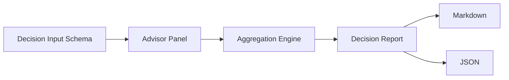

# decision-swarm

> **Multi-agent decision engine that makes disagreement explicit, measurable, and actionable.**


## ◼ Background

Complex decisions fail less from lack of data and more from hidden assumptions, missing dissent, and unstructured tradeoffs.  
decision-swarm was initiated to formalize those blind spots.

## ◼ Mission

Transform one high-stakes question into a structured recommendation package with transparent disagreement, confidence boundaries, and risk-aware execution steps.

## ◼ Vision

A reusable decision substrate for engineering/product/operations contexts where multi-perspective reasoning is required and auditability matters.

## ◼ Philosophical Stance

- **Disagreement is signal, not noise.**
- **Confidence must be explicit.**
- **Recommendations are incomplete without mitigation paths.**

## ◼ Core Deliverables

| Deliverable | Description |
|---|---|
| Direction | recommended path + confidence band |
| Dissent map | where advisor views diverge |
| Risk matrix | top risk vectors + mitigations |
| Action windows | immediate (24h) and near-term (7d) actions |

## ◼ Architecture



## ◼ MVP Scope

1. Input schema (`question`, `constraints`, `risk_tolerance`, `time_horizon`)
2. Parallel advisor execution
3. Consensus/divergence scoring
4. Multi-format report generation

## ◼ Operations Check

```bash
chmod +x scripts/ops-check.sh
./scripts/ops-check.sh
```

## ◼ Status

- [x] Repository bootstrap
- [ ] Execution engine
- [ ] Aggregation internals
- [ ] CLI workflow

## ◼ License

MIT (or project-defined license)
