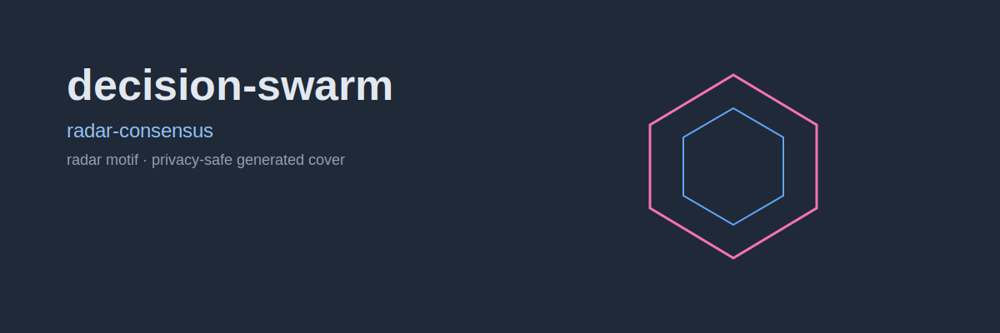
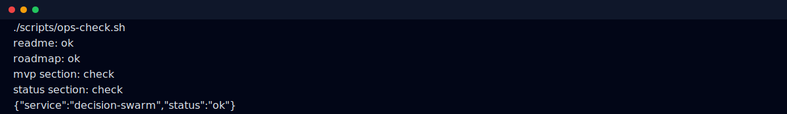

# decision-swarm

Multi-agent engine for high-stakes decision support.

<p align="center">
  
</p>

## What it does

Given one hard question, decision-swarm builds multiple advisor perspectives, then summarizes direction, disagreement, and risk into an actionable report.

## Core Outputs

- Recommendation + confidence band
- Dissent map (where and why agents disagree)
- Top risk list with mitigations
- Action checklist for near-term execution

## Screenshots

Sanitized terminal check:



## MVP scope

1. Input schema (`question`, `constraints`, `risk_tolerance`, `time_horizon`)
2. Advisor panel execution
3. Aggregation and scoring
4. Report export (Markdown + JSON)

## Operations check

```bash
chmod +x scripts/ops-check.sh
./scripts/ops-check.sh
```

Optional report output:

```bash
DECISION_SWARM_REPORT_FILE=/tmp/decision-swarm-report.json ./scripts/ops-check.sh
DECISION_SWARM_HISTORY_FILE=/tmp/decision-swarm-history.jsonl ./scripts/ops-check.sh
```

## Status

- [x] Bootstrap + base docs
- [ ] Execution engine
- [ ] Aggregation internals
- [ ] CLI workflow

## License

MIT (or project-defined license)
