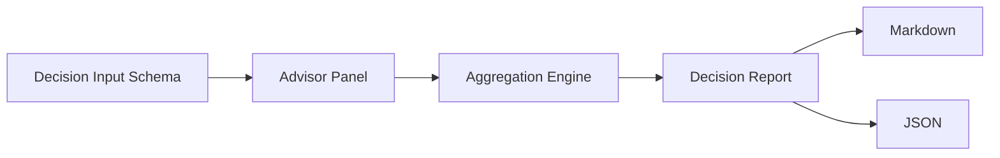

# decision-swarm

<p align="center">
  <strong>Multi-agent decision support engine</strong><br/>
  Turn one hard question into structured perspectives, risk maps, and action plans.
</p>

<p align="center">
  
  
  
</p>

---

## Overview

`decision-swarm` helps with complex decisions by orchestrating multiple advisor agents and aggregating their outputs into a concise recommendation package.

---

## Problem It Solves

Most real decisions fail because inputs are narrow and disagreement is implicit.
This project makes disagreement explicit and actionable.

---

## Core Outputs

- Recommended direction + confidence band
- Dissent map (where/why agents disagree)
- Top risks with mitigations
- Practical action checklist (24h / 7d)

---

## Planned Architecture



---

## MVP Scope

1. Input schema (`question`, `constraints`, `risk_tolerance`, `time_horizon`)
2. Parallel advisor execution
3. Aggregation and scoring
4. Report formatter

See: `docs/ROADMAP.md`

---

## Operations Check

```bash
chmod +x scripts/ops-check.sh
./scripts/ops-check.sh
```

Optional:

```bash
DECISION_SWARM_REPORT_FILE=/tmp/decision-swarm-report.json ./scripts/ops-check.sh
DECISION_SWARM_HISTORY_FILE=/tmp/decision-swarm-history.jsonl ./scripts/ops-check.sh
```

---

## Status

- [x] Repository bootstrap
- [ ] Execution engine
- [ ] Aggregation + formatter
- [ ] CLI interface

---

## License

MIT (or project-defined license).
